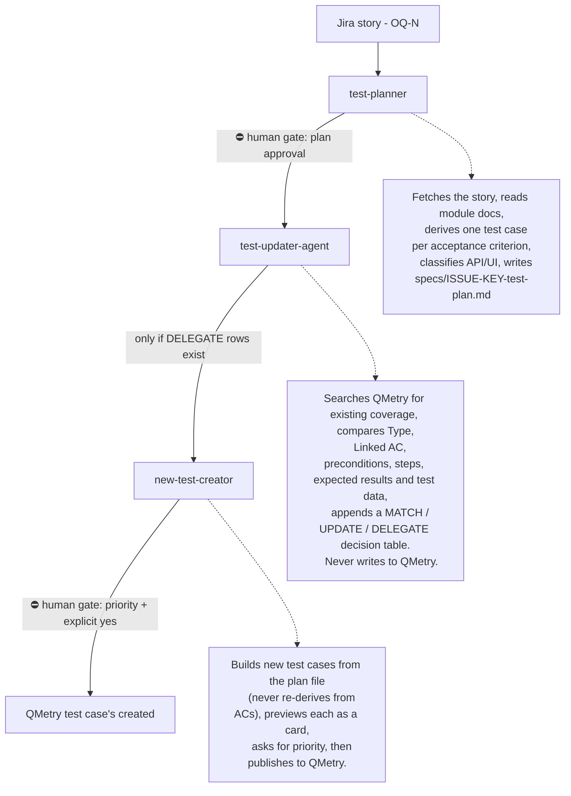

# AI-Assisted QA Pipeline — Jira → Test Plan → QMetry

An agentic QA pipeline built on Claude Code that turns a Jira user story into a reviewed test plan, reconciles it against existing QMetry test cases, and creates only the genuinely missing ones — with a human approval gate before every consequential action.

## What It Does



## Design Principles

- **Update-first.** Existing test IDs, history, and traceability are preserved: the pipeline prefers updating an existing QMetry case over creating a duplicate. Creation happens only when no existing case can serve without being gutted.
- **Human in the loop at every write boundary.** The plan is approved before QMetry is touched; new cases are previewed and explicitly confirmed before publishing; proposed updates to existing cases are always applied manually, never by the agents.
- **Single source of truth.** The test plan file is the shared contract between all three components. new-test-creator pulls case content from it directly rather than re-interpreting acceptance criteria, eliminating drift between agents.
- **Flag, don't fix.** When the pipeline detects a suspected mislabel (e.g. a Linked AC tag conflicting with a strong content match), it flags the conflict for human review — it never silently corrects existing data.
- **Hard stops over guesses.** Vague ACs, unreadable dependencies, and unresolvable QMetry folders all stop the pipeline and ask, rather than proceeding on assumptions.

## Pipeline Files

```
skills/
  test-planner/
    README.md                            # this file
    SKILL.md                             # test plan generation skill
    assets/
      test-classification-patterns.md    # API/UI classification lookup
                                          + decision algorithm
agents/
  test-updater.md                        # QMetry comparison
                                          + decision-table
  new-test-creator.md                    # QMetry test case creation

docs/
  admin.md                               # module documentation
                                          read by test-planner
validation/
  test-planner/
    OQ-12-test-plan.md                   # generated plan
                                          from the validation run
    OQ-12-validation-report.md           # findings, log verification
                                          pre-run design review
```

## Conventions

- **Linked AC format:** `{ISSUE-KEY}-AC#` (e.g. `OQ-12-AC1`) — scoped to the story so bare `AC1` tags can't collide across stories in the same QMetry project.
- **QMetry Description field:** every created case carries `Linked AC: {value} | Type: {value}` — the same field test-updater reads when comparing against later plans.
- **Decision values:** `MATCH` (full coverage, no changes) / `UPDATE` (close a specific gap, applied manually) / `DELEGATE` (no viable existing case → create new).

## Prerequisites

- Claude Code with Atlassian (Jira) and QMetry MCP servers configured
- `CLAUDE.md` populated with the QMetry Project ID and Project Key
- Target app for test execution: OrangeHRM demo instance

## Usage

```
Generate a test plan for OQ-12
```

The pipeline handles the rest: plan → your approval → QMetry comparison table → (if needed) preview cards → your priority choice and explicit confirmation → publish.

## Validation

The pipeline was validated end-to-end using **seeded-fault test data**: QMetry cases deliberately crafted to trigger one specific behavior each (a mislabeled Linked AC, a Type mismatch, missing tags with off-target content, partial-coverage gaps, and one AC with no coverage at all), with every agent decision scored against a predefined expected outcome and verified against raw agent logs and live QMetry data.

Full results, findings, and the pre-run design review: **OQ-12 Validation Report**
